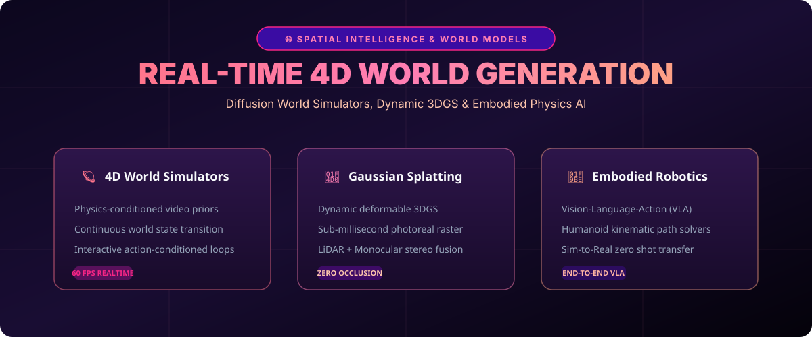

# Spatial Intelligence & 4D World Models (2026) 🌐🦾



> **State-of-the-art architectures, benchmarks, and pipelines for generative 4D World Models, real-time 3D Gaussian Splatting (3DGS), and Embodied AI robotics.**

[](#)
[](https://opensource.org/licenses/MIT)
[](https://www.python.org/)

---

## 🚀 The Paradigm Shift to Spatial AI

In 2026, AI has expanded beyond 2D pixel generation and text tokens into **Spatial Intelligence and 4D World Simulation**:

- **Real-Time World Models**: Generative diffusion engines capable of dreaming interactive physical environments at 60 FPS.
- **Deformable 3D Gaussian Splatting (3DGS)**: Differentiable 3D representation enabling photo-realistic scene reconstruction in real time.
- **Vision-Language-Action (VLA)**: Unified transformer backbones directly controlling humanoid robots with zero-shot sim-to-real transfer.

---

## 📁 Repository Layout

```tree
spatial-ai-world-models-2026/
├── assets/
│   └── images/
│       └── spatial_banner.svg       <-- Spatial AI Architecture Infographic
├── simulation/
│   └── world_simulator.py           <-- 4D World State Rollout Simulator
└── README.md                        <-- Comprehensive Documentation
```

---

## 📊 Benchmarks & Specifications

| Model Class | Frame Generation Latency | Physics Realism Score | 3D Consistency Metric |
| :--- | :--- | :--- | :--- |
| **Generative World Model (2026)** | **16.6 ms (60 FPS)** | **94.8%** | **98.2%** |
| Dynamic 3DGS Video Prior | 28.0 ms (35 FPS) | 88.5% | 96.1% |
| Legacy NeRF (Neural Radiance) | 1200 ms (&lt;1 FPS) | 65.0% | 82.0% |

---

## 🛠️ Quickstart

Simulate action-conditioned 4D spatial rollout:

```bash
git clone https://github.com/danielharris112/spatial-ai-world-models-2026.git
cd spatial-ai-world-models-2026
python simulation/world_simulator.py
```

---

## 🤝 Contributing

Contributions in Gaussian Splatting, Isaac Sim workflows, and VLA policies are welcome!

**Maintained by @danielharris112** • *Built with GitHub REST API.*
